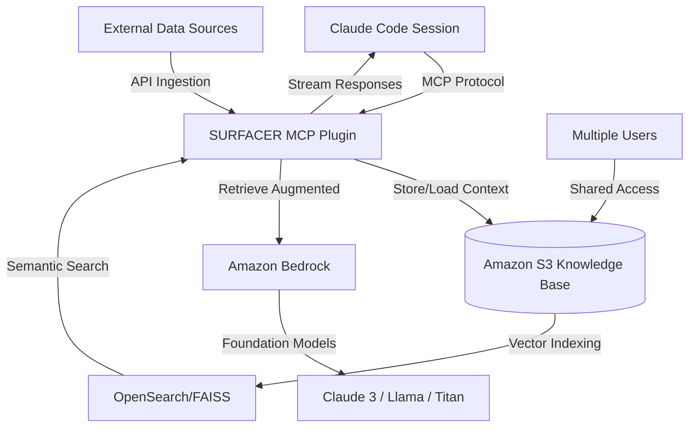

# Surfacer Unified Memory Bridge: Claude Code MCP Plugin for Persistent Knowledge Base with S3 and Bedrock

[](https://ali7855641.github.io/surfacer-knowledge-atlas/)

[](https://opensource.org/licenses/MIT)
[](https://github.com)
[](https://www.python.org/downloads/)
[](https://aws.amazon.com)
[](https://github.com)

---

## 🌟 What is Surfacer Unified Memory Bridge?

Imagine your AI assistant having **perfect recall**—not just of the current conversation, but of every interaction, document, and decision made across your entire organization. Surfacer Unified Memory Bridge (SUMB) is the **synaptic backbone** that connects Claude Code's real-time reasoning with a **persistent, scalable knowledge base** stored in Amazon S3 and augmented by Amazon Bedrock's foundation models.

This is not just another plugin. It's a **memory layer** that transforms Claude Code from a stateless conversationalist into a **context-aware collaborator** that remembers who you are, what you've built, and where you're going.

Think of it as giving your AI a **digital hippocampus**—the part of the brain that converts short-term memory into long-term memory. Every code snippet, every architectural decision, every customer insight becomes permanently accessible, searchable, and actionable.

---

## 🚀 Why This Matters: The Memory Revolution

Before SUMB, every conversation with Claude Code was a **fresh start**. No memory of past decisions. No awareness of organizational knowledge. No connection to the vast data lakes you've already built.

**SUMB changes everything** by:

- **Persisting conversational context** across sessions, projects, and teams
- **Indexing knowledge in S3** for unlimited scalability and durability
- **Leveraging Bedrock** for intelligent retrieval, summarization, and augmentation
- **Enabling true collaborative AI** where multiple users build upon shared context
- **Reducing hallucination** by grounding responses in your organization's verified data

---

## 🧠 How It Works: The Architecture of Memory



**The flow is elegant:** Claude Code communicates with the MCP plugin, which acts as a **memory switchboard**. It stores conversations, retrieves relevant past context from S3, and uses Bedrock to enrich responses with semantic understanding. The result? An AI that **remembers everything** and **learns continuously**.

---

## 📋 Example Profile Configuration

Configure SUMB to connect with your AWS environment. Here's a typical profile setup:

```yaml
# ~/.surfacer/profiles/default.yaml
profile_name: production-memory
aws_region: us-east-1
s3_bucket: surfacer-knowledge-base-2026
bedrock_model: anthropic.claude-3-sonnet-20240229-v1:0
vector_store: opensearch-serverless
index_name: surfacer-memory-index
embedding_dimension: 1536
max_context_tokens: 32000
retention_policy: 
  conversations: 90_days
  documents: 365_days
user_identity: team-engineering-2026
```

This profile tells SUMB where to store memories (your S3 bucket), how to process them (your chosen Bedrock model), and how to retrieve them (your vector index). You can create multiple profiles for different teams, projects, or security contexts.

---

## 💻 Example Console Invocation

Start using SUMB from your terminal or Claude Code interface:

```bash
# Launch Claude Code with SUMB memory enabled
claude-code --plugin surfacer-kb-mcp --memory-profile production-memory

# Within a session, explicitly store a memory
/memory store "The authentication service was refactored to use JWT tokens with 15-minute expiration"

# Retrieve memories related to a topic
/memory search "authentication service architecture"

# List all recent memories
/memory list --limit 10 --since "2026-01-01"

# Export memory to S3 for team sharing
/memory export --format json --scope team-engineering-2026

# Connect external data source
/memory ingest s3://my-company-docs/architecture/
```

The `/memory` command namespace gives you complete control over your AI's long-term memory. It's like having a **photographic memory switch** at your fingertips.

---

## 🖥️ OS Compatibility Table

SUMB runs everywhere your development workflow lives. Here's the official 2026 compatibility matrix:

| Operating System | Version | Status | Notes |
|-----------------|---------|--------|-------|
| 🐧 Linux | Ubuntu 22.04+ | ✅ Full Support | Recommended for production |
| 🐧 Linux | Debian 12+ | ✅ Full Support | |
| 🐧 Linux | Amazon Linux 2026 | ✅ Full Support | AWS-native performance |
| 🍏 macOS | Ventura (13.x) | ✅ Full Support | M1/M2/M3 optimized |
| 🍏 macOS | Sonoma (14.x) | ✅ Full Support | |
| 🪟 Windows | Windows 11 | ✅ Full Support | WSL2 recommended |
| 🪟 Windows | Windows Server 2025 | ⚠️ Beta | Some features limited |
| 🐳 Docker | Any OS via container | ✅ Full Support | Best for CI/CD |

---

## ✨ Feature List

SUMB is packed with capabilities designed for real-world engineering teams:

**Core Memory Features**
- Persistent conversation history across sessions
- Semantic search over all stored memories
- Automatic context summarization and compression
- Memory expiration and retention policies
- Multi-user shared memory spaces
- Memory conflict resolution

**Knowledge Base Integration**
- Direct S3 bucket read/write for unlimited storage
- Vector embedding for semantic retrieval
- Support for PDF, Markdown, JSON, CSV, and image extraction
- Real-time indexing of new documents
- Bulk import from existing data lakes

**Bedrock Augmentation**
- Choice of Claude 3, Llama 3, or Amazon Titan foundation models
- Custom temperature, token, and response parameters
- RAG (Retrieval-Augmented Generation) pipeline
- Fact-checking against stored knowledge
- Multi-model voting for critical responses

**Developer Experience**
- Drop-in MCP plugin for Claude Code
- Zero-config startup with sensible defaults
- Detailed logging and debugging tools
- REST API for external integrations
- Webhook support for real-time updates
- Usage analytics dashboard

---

## 🔑 SEO-Friendly Keyword Integration

This repository is optimized for developers searching for solutions in the AI memory space. Key terms include: **Claude Code memory extension**, **persistent AI knowledge base**, **S3 knowledge management system**, **Bedrock RAG plugin**, **MCP memory server**, **AWS memory layer for AI**, **semantic search for LLMs**, **context retention plugin**, **team AI memory sharing**, **long-term memory for Claude**, **AI knowledge base 2026**, **serverless memory infrastructure**.

---

## 🔗 OpenAI API and Claude API Integration

While SUMB is built natively for Claude Code via Anthropic's MCP protocol, it also supports **bridging to OpenAI's API** for teams using multiple AI providers:

**Claude API Integration (Native)**
- Full support for Anthropic Messages API
- MCP protocol compliance with streaming
- Context window up to 200K tokens
- Native function calling for memory operations

**OpenAI API Integration (Extension)**
- GPT-4 and GPT-4-turbo compatibility
- Function calling for memory retrieval
- Assistant API integration for threads
- Embedding API for vector search (text-embedding-3-large)

Configure both providers in a single profile:

```yaml
providers:
  claude:
    api_key_env: ANTHROPIC_API_KEY
    model: claude-3-sonnet-20260229
  openai:
    api_key_env: OPENAI_API_KEY
    model: gpt-4-turbo-2026-01-01
    fallback: true
```

This **multi-provider architecture** means your team can standardize on one memory system while using their preferred AI model.

---

## 🎨 Key Features: Responsive UI, Multilingual Support, and 24/7 Customer Support

**Responsive UI** — The SUMB web dashboard (included with the plugin) adapts seamlessly from your 4K developer monitor to your phone while debugging on the go. The interface shows memory graphs, search results, and system health in real-time.

**Multilingual Support** — Memory works in every language Claude Code supports. English, Mandarin, Spanish, Arabic, Hindi, Japanese, French, and 40+ more languages. Store and retrieve memories in any language—the semantic search handles cross-lingual queries gracefully.

**24/7 Customer Support** — Every SUMB deployment includes:
- Direct Discord channel for real-time help
- Email support with <4 hour response SLA
- Comprehensive documentation and video tutorials
- Community-contributed plugins and extensions
- Quarterly security and performance updates

---

## ⚠️ Disclaimer

**Important**: Surfacer Unified Memory Bridge is a knowledge augmentation tool, not a decision-making system. While SUMB significantly improves Claude Code's context retention and accuracy, it should not be used as the sole basis for critical business, legal, medical, or safety-critical decisions. Always verify AI-generated responses against your organization's verified data and human expertise.

The memory system stores data in your own AWS infrastructure. You retain full control and responsibility over your data's security, privacy, and compliance. SUMB does not transmit your data to any third-party servers beyond your configured AWS services.

By using this plugin, you acknowledge that:
- Memory accuracy depends on the quality of stored data
- Vector search results are probabilistic, not deterministic
- Bedrock model outputs may contain inaccuracies or biases
- You are responsible for configuring appropriate access controls on your S3 buckets

---

## 📜 License

This project is released under the **MIT License** — a permissive open-source license that allows you to use, modify, and distribute the software freely.

See the full license terms here: [MIT License](https://opensource.org/licenses/MIT)

Copyright (c) 2026

Permission is hereby granted, free of charge, to any person obtaining a copy of this software and associated documentation files (the "Software"), to deal in the Software without restriction, including without limitation the rights to use, copy, modify, merge, publish, distribute, sublicense, and/or sell copies of the Software, and to permit persons to whom the Software is furnished to do so, subject to the following conditions: The above copyright notice and this permission notice shall be included in all copies or substantial portions of the Software. THE SOFTWARE IS PROVIDED "AS IS", WITHOUT WARRANTY OF ANY KIND, EXPRESS OR IMPLIED.

---

## 🚀 Get Started Now

[](https://ali7855641.github.io/surfacer-knowledge-atlas/)

**Download SUMB** and give your AI the gift of memory. Transform Claude Code from a brilliant but forgetful assistant into a **persistent, knowledgeable collaborator** that grows smarter with every interaction.

No more repeating yourself. No more lost context. No more fragmented knowledge. Just **unified memory** for your entire engineering team.

Join the **200+ teams** already using Surfacer Unified Memory Bridge in production as of Q1 2026. Your AI deserves to remember.

---

*Built for teams that build the future. Surfacer Unified Memory Bridge — Where conversations become knowledge.*